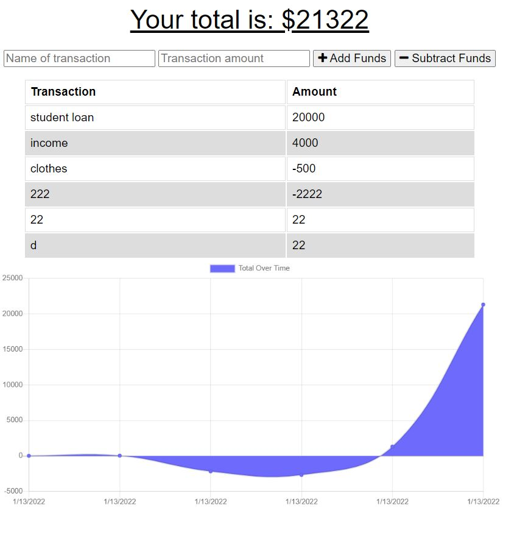

# Budget-Tracker

## Description

This application allows users to add expenses and deposits to their budget with or without a connection. When entering transactions offline, they should populate the total when brought back online.



## Table of Contents

* [Installation](#installation)

* [Usage](#usage)

* [Contributing](#contributing)

* [Tests](#tests)

* [Questions](#questions)

## Installation

To install the necessary depencies, run the following command:
```
npm i
```

## Usage
Just install using the command above and start keeping track of your finances *offline*!

## Contributing
Please submit pull requests and become part of the team.

## Tests
```
npm test
```

## Questions

If you have any questions about the repository, open an issue or contact me directly at nothingbutgoodthoughts@comcast.net
You can find more of my work at [aod1411](https://github.com/aod1411)